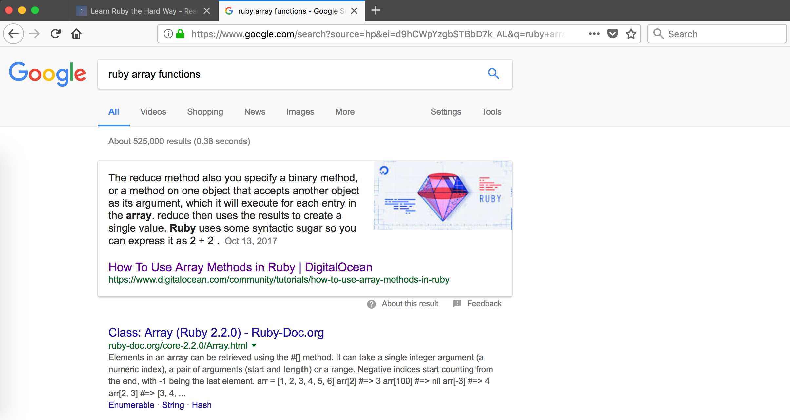

#### Notes

###### Install Ruby

```sh
sudo apt-get install ruby-full
```

```sh
l64@box:~$ ruby -v
ruby 2.3.3p222 (2016-11-21) [x86_64-linux-gnu]
l64@box:~$ 
```

###### Terminal Basics

```sh
l64@box:~/Desktop$ mkdir mystuff
l64@box:~/Desktop$ cd mystuff/
l64@box:~/Desktop/mystuff$ nano test.txt
l64@box:~/Desktop/mystuff$ cat test.txt
Finally I am going to learn Ruby !!
Hope I succeed.
Wish me luck.
l64@box:~/Desktop/mystuff$ ls
test.txt
l64@box:~/Desktop/mystuff$
```

###### Interactive Ruby Shell

```sh
l64@box:~/Desktop/mystuff$ irb
irb(main):001:0> 6+8
=> 14
irb(main):002:0> quit()
l64@box:~/Desktop/mystuff$
```

###### Finding Things on the Internet

``ruby array functions``



###### Escape Sequences

**Escape**|**What it does.**
:-----:|:-----:
\\ |Backslash ()
\' |Single-quote (')
\" |Double-quote (")
\a |ASCII bell (BEL)
\b |ASCII backspace (BS)
\f |ASCII formfeed (FF)
\n |ASCII linefeed (LF)
\r |ASCII Carriage Return (CR)
\t |ASCII Horizontal Tab (TAB)
\uxxxx |Character with 16-bit hex value xxxx (Unicode only)
\v |ASCII vertical tab (VT)
\ooo |Character with octal value ooo
\xhh |Character with hex value hh

###### Format Specifier

```
%{}
```

- User defined format

```
#{}
```

- In-built format

###### Multi line strings

```
'''
```

- Multi-line string containing ``#{}`` will be processed

```
"""
```

- Multi-line string containing ``#{}`` will not be processed
